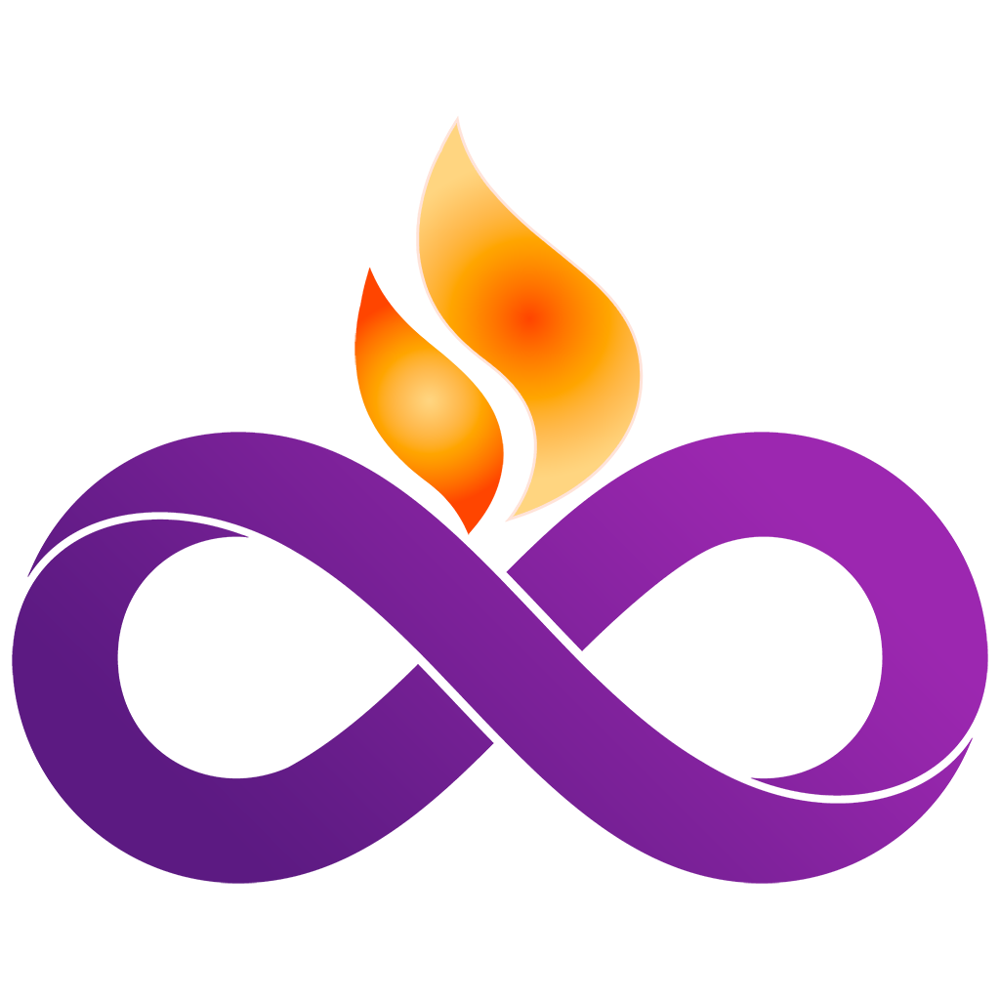

<!DOCTYPE html>
<html lang="en">
<head>
  <meta charset="UTF-8"/>
  <meta name="viewport" content="width=device-width, initial-scale=1.0"/>
  <meta name="description" content="The Spark is the open, community-built symbol representing generative AI — human-centered, creative, and universal. Free to use by all.">
  <title>The Spark – Universal Symbol for Generative AI</title>
   <link rel="icon" href="assets/spark-favicon.png" type="image/png">
   
</head>
<body>
  <h1>The Spark</h1>
  
From one human spark, infinite creation.

  
  

    The Spark is a free, open symbol for generative AI — 
    inspired by human creativity, designed for universal use.
  

  <a class="download" href="https://github.com/lara9taylor/spark-icon-color.svg" target="_blank">View on GitHub</a>
  

    Visit <a href="https://sparksymbol.org">sparksymbol.org</a> or download from GitHub. 
    Released under <a href="https://creativecommons.org/publicdomain/zero/1.0/" target="_blank">CC0 License</a>.
  

</body>
</html>
